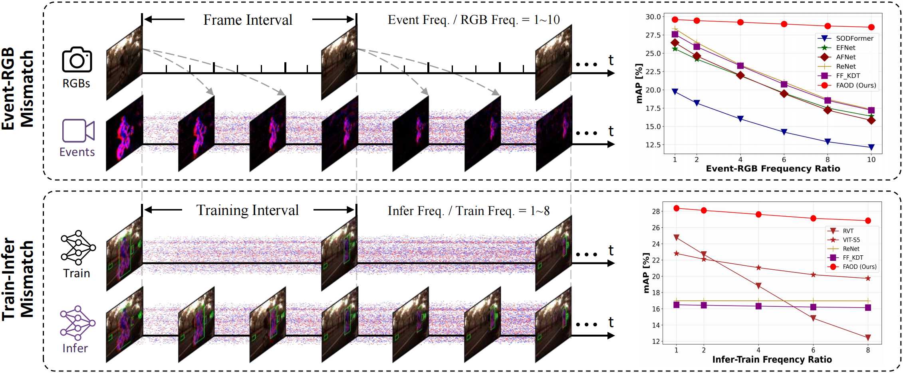

# Frequency-Adaptive Low-Latency Object Detection Using Events and Frames
Official code repository for Frequency-Adaptive Low-Latency Object Detection Using Events and Frames.
<p align="center">
  
</p>

## Videos

### Under Event-RGB Mismatch
<p align="center">
  
</p>


### Under Train-Infer Mismatch
<p align="center">
  
</p>

## Installation
We recommend using cuda11.8 to avoid unnecessary environmental problems.
```
conda create -y -n faod python=3.11

conda activate faod

pip install torch==2.1.1 torchvision==0.16.1 torchdata==0.7.1 torchaudio==2.1.1 --index-url https://download.pytorch.org/whl/cu118

pip install wandb pandas plotly opencv-python tabulate pycocotools bbox-visualizer StrEnum hydra-core einops torchdata tqdm numba h5py hdf5plugin lovely-tensors tensorboardX pykeops scikit-learn ipdb timm opencv-python-headless pytorch_lightning==1.8.6 numpy==1.26.3

pip install openmim

mim install mmcv
```
## Required Data
We provide datasets with the similar format of [RVT](https://github.com/uzh-rpg/RVT) for easy implements. 

Noth that the following datasets are paired Event-RGB. Trying to evaluate ``Event-RGB Mismatch`` and ``Train-Infer Mismatch``?
Following these instructions to create unpaired Event-RGB datasets. 
<table>
  <tr>
    <th style="text-align:center;">Download Links</th>
    <th style="text-align:center;"><a href="https://drive.google.com/drive/folders/12PprdOSXhIrlp-xPKeboaVf7G8SPuyJB?usp=drive_link">PKU-DAVIS-SOD</a></td>
    <th style="text-align:center;"><a href="https://drive.google.com/drive/folders/1sqaqS2TWkx8tSdVj4WFJD1uugUaKSX9j?usp=drive_link">DSEC-Detection</a></td>
  </tr>
</table>

## Checkpoints
<table>
  <tr>
    <th style="text-align:center;">PKU-DAVIS-SOD (Time Shift)</th>
    <th style="text-align:center;">PKU-DAVIS-SOD</th>
    <th style="text-align:center;">DSEC-Detection</th>
  </tr>
  <tr>
    <td style="text-align:center;"><a href="https://1drv.ms/u/c/93289205239bc375/EQue4dcG4M9Ggbu5dM-iOc0Bphskqnh1zua2rogpYNkANw?e=crXrjv">mAP = 29.7</a></td>
    <td style="text-align:center;"><a href="https://1drv.ms/u/c/93289205239bc375/EQue4dcG4M9Ggbu5dM-iOc0Bphskqnh1zua2rogpYNkANw?e=crXrjv">mAP = 30.5</a></td>
    <td style="text-align:center;"><a href="https://1drv.ms/u/c/93289205239bc375/ETetOpGDDyJDsN_5lTkvdwEBqEvm9kw2aqdXDNCiHn4FAg?e=c1yTGf">mAP = 42.5</a></td>
  </tr>
</table>

## Validation with pre-trained models
Define the ``DATASET``, ``DATA_PATH``, ``CHECKPOINT``, and then run the following command:
```python
python validation.py dataset={DATASET} dataset.path={DATA_PATH} checkpoint={CHECKPOINT} +experiment/{DATASET}='base.yaml'
```
Other settings like ``use_test_set``, ``training.precision``, ``batch_size.eval``, ``hardware.num_workers`` can be set in file ``config/val.yaml`` 
and ``config/experiment/{DATASET}/default.yaml`` conveniently.

## Train FAOD with scratch
Define the ``DATASET``, ``DATA_PATH``, and then run the following command:
```python
python train.py dataset={DATASET} dataset.path={DATA_PATH} +experiment/{DATASET}='base.yaml'
```
Other settings like ``training.precision``, ``batch_size.train``, ``hardware.num_workers`` can be set in file ``config/train.yaml`` 
and ``config/experiment/{DATASET}/default.yaml`` conveniently.
Training FAOD with/without Time Shift? Following this instruction.

## Citation
coming soon~

